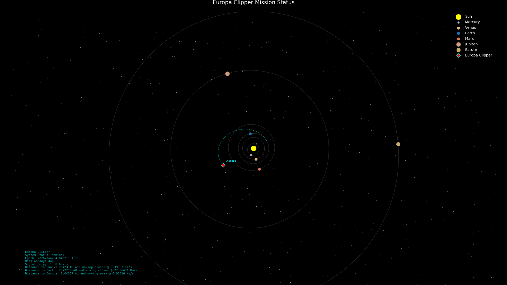

# 🛰️ ClipperWatch

**ClipperWatch** is a high-fidelity orbital tracking dashboard for NASA's Europa Clipper mission as well as other deep space spacecraft. It pulls real-time telemetry from JPL Horizons to render a mathematically accurate, minimalist 1080p map of the solar system, designed for use as a desktop lock screen / wallpaper.

## 🚀 Features
- **Real-time Tracking:** Pulls live ephemeris data for the Sun, Planets, and the target spacecraft.
- **Accurate Physics:** Orbits are rendered as Keplerian ellipses using orbital elements.
- **Mission HUD:** Displays mission day, light-speed signal delay, and relative velocities (Sun, Earth, Europa).
- **Spacecraft "Comet Tail":** Visualizes the trail of the spacecraft's trajectory.

## 🛠️ Install dependencies

    pip install astropy astroquery matplotlib numpy

### Debian systems

    sudo apt install python3-astropy python3-astroquery python3-matplotlib python3-numpy 

## 🖥️ Usage

Run the script directly to open an interactive window:

    python3 clipperwatch.py

Command Line Arguments
Argument	Description
--save	Saves the output directly to disk instead of opening a window.
--output <name>.png	Sets a custom filename for the saved image (Default: clipper_watch.png).
--list Lists all the supported spacecrafts
--spacecraft <name> Select target spacecraft (Europa Clipper by default)

Example:

    python3 clipperwatch.py --save --output lockscreen.png
    python3 clipperwatch.py --spacecraft Lucy

## 📟 Systemd Integration

Systemd service can ensure this script runs on boot after networking is up.

Copy the .config/ files under ~/.config/. Edit clipperwatch.service so that
it stores the file to wherever you want it to and also update the path for the python script.

You should end up with:

    ~/.config/systemd/user/clipperwatch.service
    ~/.config/systemd/user/clipperwatch.timer

Then

    systemctl --user daemon-reload
    systemctl --user enable clipperwatch.timer
    systemctl --user restart clipperwatch.timer
    systemctl --user list-timers clipperwatch.timer

## 📊 Math & Data

Data Source: [NASA/JPL Horizons API](https://ssd.jpl.nasa.gov/horizons/manual.html)

Coordinate System: Heliocentric Ecliptic (J2000)

Scale: 1 unit = 1 Astronomical Unit (AU).

## 📡 Cool links

NASA has quite a few cool websites that can be used to gather data and track spacecraft:

https://eyes.nasa.gov/apps/solar-system/#/sc_europa_clipper

https://ssd.jpl.nasa.gov/horizons/app.html#/

https://eyes.nasa.gov/apps/dsn-now/dsn.html

**Disclaimer:** This project is a fan-made tool and is not officially affiliated with NASA or JPL.
